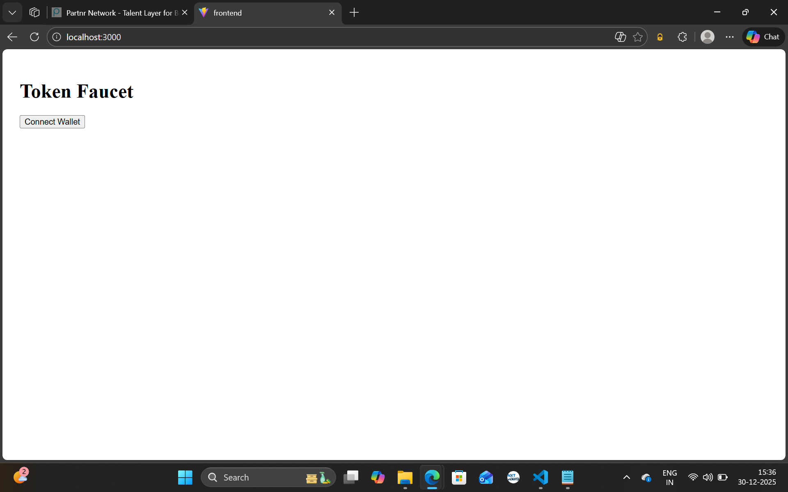
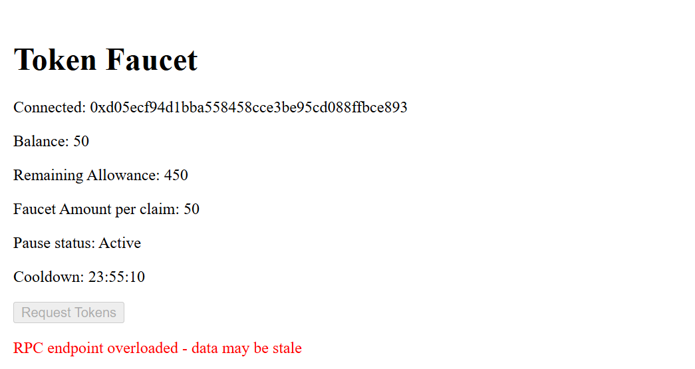

# 🚀 Web3 Token Faucet DApp (ERC-20 + Cooldown + Lifetime Limits)

This project is a production-ready **decentralized faucet system** demonstrating real-world Web3 engineering:

✔ ERC-20 token  
✔ On-chain rate limits  
✔ Wallet connection (EIP-1193)  
✔ Real-time UI sync  
✔ Verified contracts on testnet  
✔ Dockerized frontend  
✔ Health endpoint + evaluation API

It enforces business rules **fully on-chain** with no centralized trust:

- 24-hour cooldown
- Per-address lifetime limit
- Faucet pause/unpause admin control
- Safe, gas-efficient minting
- Transparent event logs

---

## 🏗 Architecture Overview

```mermaid
graph TB
    User[👤 User Wallet<br/>MetaMask]
    
    subgraph Frontend["🖥️ Frontend (React + Vite)"]
        UI[User Interface]
        Ethers[ethers.js Library]
        Eval[window.__EVAL__ API]
    end
    
    subgraph Blockchain["⛓️ Sepolia Testnet"]
        RPC[RPC Provider<br/>Infura/Alchemy]
        
        subgraph Contracts["Smart Contracts"]
            Faucet[TokenFaucet Contract<br/>0x77fA...c24]
            Token[FaucetToken ERC-20<br/>0xcd71...7aE]
        end
    end
    
    User -->|1. Connect Wallet<br/>eth_requestAccounts| UI
    UI -->|2. Query State<br/>eth_call| Ethers
    Ethers -->|balanceOf, canClaim,<br/>remainingAllowance| RPC
    RPC -->|Read Operations| Faucet
    RPC -->|balanceOf| Token
    
    User -->|3. Request Tokens| UI
    UI -->|eth_sendTransaction| Ethers
    Ethers -->|requestTokens| RPC
    RPC -->|4. Validate<br/>Cooldown + Limits| Faucet
    Faucet -->|5. mint(user, 50)| Token
    Token -->|6. Transfer Event| RPC
    RPC -->|7. Updated Balance| Ethers
    Ethers -->|8. UI Refresh| UI
    
    Eval -.->|Testing Interface| Ethers
    
    style User fill:#e1f5ff
    style Faucet fill:#ffeb99
    style Token fill:#ffeb99
    style RPC fill:#d4edda
```

### High-Level Flow

1. **Wallet Connection**: User connects MetaMask via EIP-1193
2. **State Query**: Frontend reads token balance, claim eligibility, cooldown status
3. **Claim Request**: User clicks "Request Tokens" button
4. **Validation**: Faucet contract checks cooldown (24h), lifetime limit (500 tokens), pause state
5. **Minting**: If eligible, faucet mints 50 tokens to user address
6. **Event Emission**: `TokensClaimed` event emitted with user, amount, timestamp
7. **Balance Update**: Frontend listens for transaction confirmation
8. **UI Refresh**: Display updates with new balance and cooldown timer

### Component Interactions

- **Frontend ↔ RPC**: All blockchain reads/writes via ethers.js
- **Faucet → Token**: Faucet has exclusive minting rights
- **Rate Limiting**: On-chain enforcement (no backend needed)
- **Evaluation API**: `window.__EVAL__` exposes testing interface


## 🔗 Deployed Contracts (Sepolia)

**Token (FaucetToken)**   
Etherscan: https://sepolia.etherscan.io/address/0xcd7184199F7f614F09C40dfaD5d2b383723597aE

**Faucet (TokenFaucet)**  
Etherscan: https://sepolia.etherscan.io/address/0x77fAC3F0EA4eFEB1D0e44F5F026AA9E156e7aC24

Both contracts are verified.

---

## 📂 Project Structure (root)

- contracts/ (Token.sol, TokenFaucet.sol, tests)
- scripts/deploy.js
- frontend/ (React + Vite, nginx serving dist)
- docker-compose.yml
- hardhat.config.js
- .env.example
- screenshots/

---

## ⚙️ Requirements

- Node 18+
- Docker Desktop
- MetaMask
- Sepolia test ETH

---

## 🚧 Local Development (without Docker)

```bash
# install deps
npm install

# compile
npx hardhat compile

# run tests
npx hardhat test

# deploy to sepolia
npx hardhat run scripts/deploy.js --network sepolia

# frontend
cd frontend
npm install
npm run dev
```

Required env (.env based on .env.example):
- SEPOLIA_RPC_URL
- PRIVATE_KEY
- ETHERSCAN_API_KEY
- VITE_RPC_URL
- VITE_TOKEN_ADDRESS
- VITE_FAUCET_ADDRESS

## 🐳 Docker Deployment

```bash
cp .env.example .env  # fill values
docker compose up --build
# http://localhost:3000
# health: http://localhost:3000/health (returns OK)
```

---

## 📸 Screenshots

### Wallet Connection

*Initial screen prompting user to connect their MetaMask wallet*

### Claim Successful

*Successful token claim transaction with updated balance and active cooldown timer*
